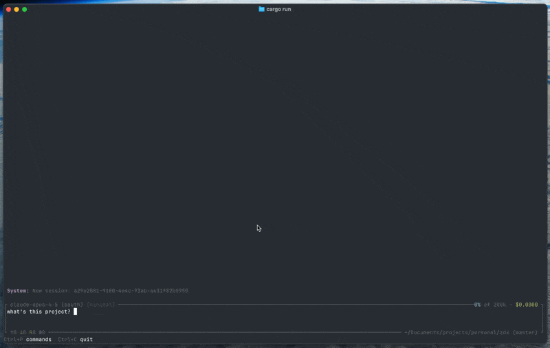

# ZDX

A fast, beautiful agentic coding assistant.

## What it is

- **4 tools only:** `bash`, `read` (files + images), `edit`, `write` — everything else can be handled through bash
- **Handoff** — AMP-style context-aware prompt generation to start fresh sessions ([learn more](https://ampcode.com/news/handoff))
- **No MCP support** — if you need it, check out [mcporter](https://github.com/steipete/mcporter)

Good enough to build itself — I use zdx to develop zdx.

## Why it exists

Built because I needed something:
- **Productive** — shortcuts, command palette, everything at my fingertips
- **Fast and lightweight** — can spawn multiple instances when needed
- **Pleasant to use** — beautiful and elegant, for all-day use

Also a way to learn TUI development, contribute to open source, and build an AI product using AI.

## Features

- **Anthropic provider** with API key or OAuth authentication
- **Open AI (Codex) provider** with OAuth authentication
- **Interactive TUI** with streaming markdown, syntax highlighting, and table support
- **Exec mode** — non-interactive mode for scripts and automation
- **Extended thinking** with configurable levels and block display
- **Command palette** overlay (Ctrl+P or `/`) — model picker, thinking level, and more
- **File picker** — type `@` to browse and insert project files (respects .gitignore)
- **Text selection** — click and drag to select, auto-copies to clipboard
- **Token usage** display with pricing
- **Session persistence** — resume or switch between previous conversations
- **Timeline overlay** — jump to turns and fork from any message
- **Project context** via `AGENTS.md` files (recursively loaded from parent directories)

## Inspiration

This project was inspired by several excellent tools in the agentic coding space:

- [pi-mono](https://github.com/badlogic/pi-mono) — AI-powered coding agent with terminal UI and SDK for AI-assisted development
- [codex](https://github.com/openai/codex) — OpenAI's open-source terminal-based agentic coding assistant
- [AMP](https://ampcode.com/) — Great UX inspiration for agentic coding workflows
- [opencode](https://github.com/sst/opencode) — Open-source AI coding agent with TUI, desktop app, and VS Code extension

## License

MIT
