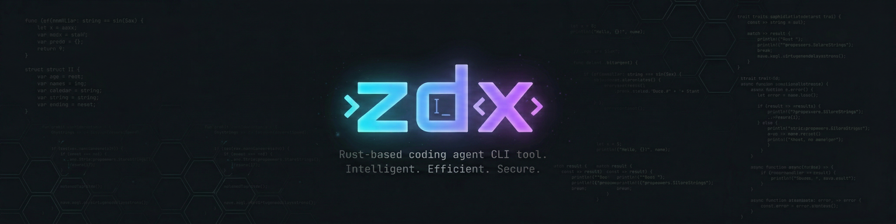

# zdx



[](https://deepwiki.com/tallesborges/zdx)
[](https://ratatui.rs/)

Zdx is a coding agent built in Rust. I made it to have customization freedom and also for learnig purpose.


> **Disclaimer**
>
> - **YOLO mode**: the agent can access your files and tools. It can make destructive changes. Use at your own risk.
> - **Early-stage**: expect breaking changes and unstable behavior while the project evolves.

## Quickstart

### Install

**Shell (macOS/Linux):**
```bash
curl --proto '=https' --tlsv1.2 -LsSf https://github.com/tallesborges/zdx/releases/latest/download/zdx-installer.sh | sh
```

**Homebrew:**
```bash
brew install tallesborges/zdx/zdx
```

**From source:**
```bash
git clone https://github.com/tallesborges/zdx.git
cd zdx
cargo install --path crates/zdx-cli
```

### Run

```bash
zdx --help
zdx
```

### Exec mode

```bash
zdx exec -p "hello"
```

### Telegram bot

```bash
zdx bot
```

> First time? Run `zdx config init` and set your provider + telegram keys.

## Features

- Just the ones I use

## Inspiration

This project was inspired by several excellent tools in the agentic coding space:

- [pi-mono](https://github.com/badlogic/pi-mono) — AI-powered coding agent with terminal UI and SDK for AI-assisted development
- [codex](https://github.com/openai/codex) — OpenAI's open-source terminal-based agentic coding assistant
- [AMP](https://ampcode.com/) — Great UX inspiration for agentic coding workflows
- [opencode](https://github.com/sst/opencode) — Open-source AI coding agent with TUI, desktop app, and VS Code extension
- oh-my-pi
## License

MIT
